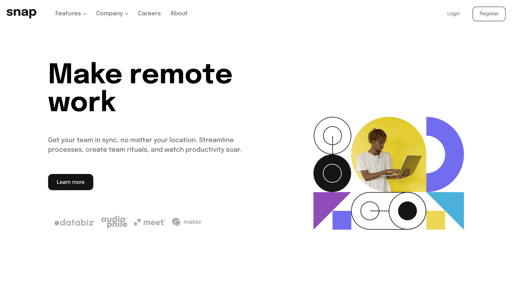
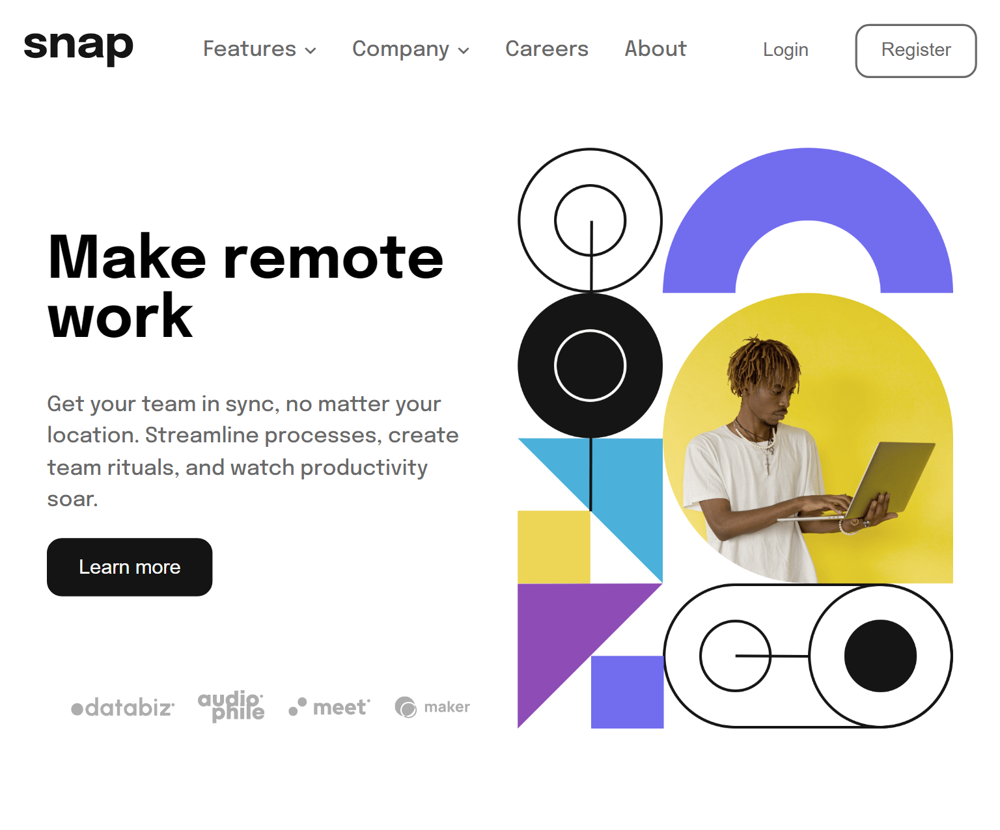
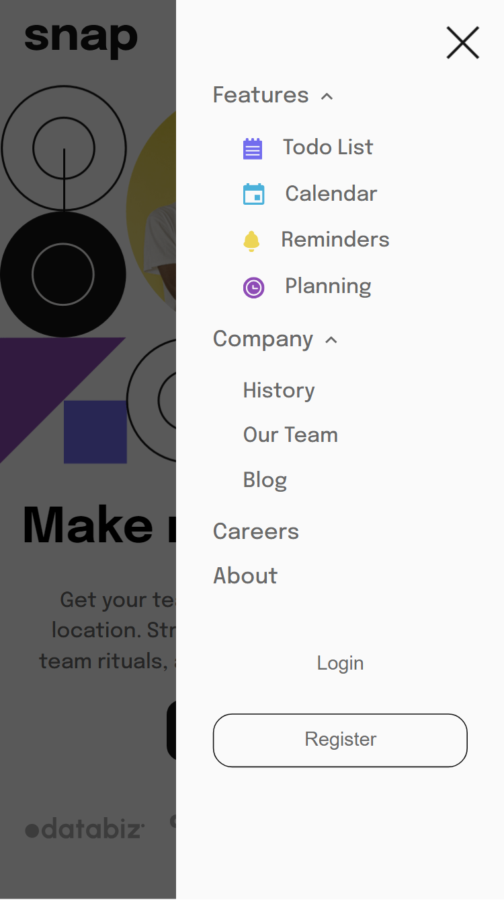

## Table of contents

  - [The challenge](#the-challenge)
  - [Screenshot](#screenshot)
  - [Links](#links)
- [My process](#my-process)
  - [Built with](#built-with)
- [Author](#author)

### The challenge

Users should be able to:

- View the relevant dropdown menus on desktop and mobile when interacting with the navigation links
- View the optimal layout for the content depending on their device's screen size
- See hover states for all interactive elements on the page

### Screenshot

Desktop Design

Tablet Design

Mobile Design

### Links

- Solution URL: [Front end Mentor Solution URL](https://www.frontendmentor.io/solutions/responsive-home-page-1gJ77SnL5z)
- Live Site URL: [Live site URL](https://snap-home-page07.netlify.app/)

## My process

### Built with

- Semantic HTML5 markup
- CSS custom properties
- SASS
- Flexbox
- Mobile-first workflow

## Author

- Frontend Mentor - [@Manan-Bhatia](https://www.frontendmentor.io/profile/Manan-Bhatia)
- Twitter - [@MananBhatia02](https://twitter.com/MananBhatia02)

